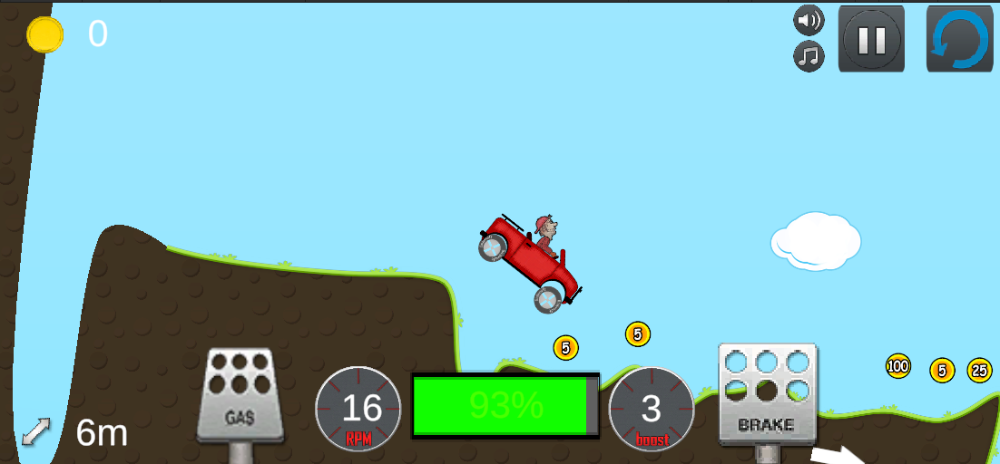
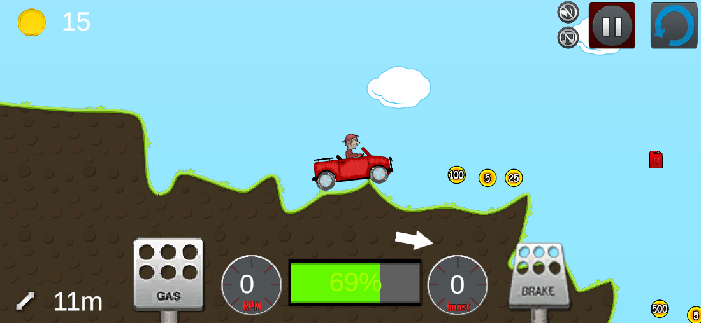
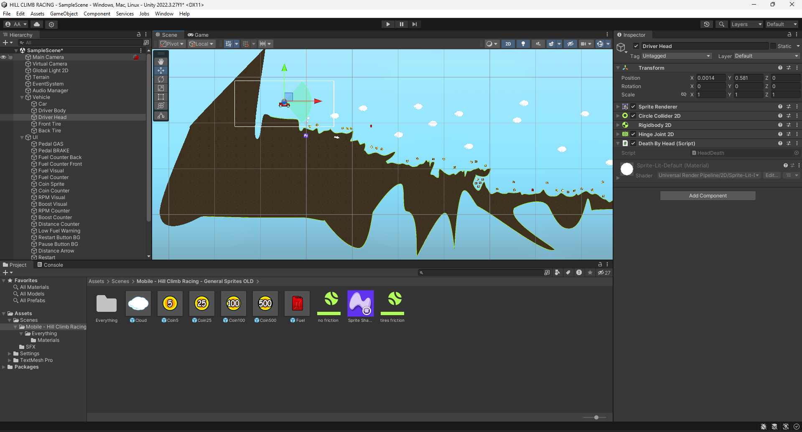

# Hill Climb Racing Recreation

This project is a reimplementation of the popular mobile game Hill Climb Racing, built with the _Unity Game Engine_. It aims to recreate the addictive gameplay experience with added features and improvements. Dive into a world with a handmade level, collectibles, immersive sound effects, intuitive UI, and delightfully wonky physics designed to challenge and entertain.


## Features

- **Handmade Level:** Explore a carefully crafted level, with its unique challenges and secrets.
- **Collectibles:** Collect coins and fuel cans to keep your journey going. Use coins to upgrade your vehicle.
- **Sound Effects:** Enjoy immersive sound effects that enhance your gameplay experience, including engine sounds, coin collection, and more.
- **UI Enhancements:** Experience an intuitive and user-friendly interface that makes navigation and gameplay smooth.
- **Wonky Physics:** The physics might be wonky, but that's where the fun begins! Become skilled at balancing and maneuvering your vehicle through rugged terrain.

## Play Now

> [!INFO]
> Experience the thrill of hill climb racing right in your browser. [Play now!](https://pyoneerc1.itch.io/hill-climb-racing-recreation)

## Screenshots


*Falling into a challenge*


*Speeding through the hills*


*Behind the scenes in Unity*

## Getting Started

### Prerequisites

- Unity Editor (Version 2020.3 LTS or newer recommended)
- Basic understanding of Unity and C#

### Installation

1. Clone the repository to your local machine: 
```bash
git clone https://github.com/pyoneerC/Hill-Climb-Racing-Recreation.git
```
2. Open the project in Unity Editor.
3. Navigate to the `Scenes` folder and open the main scene to start editing or playing.

## Contributing

Contributions are what make the open-source community such an amazing place to learn, inspire, and create. Any contributions you make are **greatly appreciated**.

1. Fork the Project
2. Create your Feature Branch (`git checkout -b feature/AmazingFeature`)
3. Commit your Changes (`git commit -m 'Add some AmazingFeature'`)
4. Push to the Branch (`git push origin feature/AmazingFeature`)
5. Open a Pull Request

## License

Distributed under the MIT License. See [LICENSE](https://github.com/pyoneerC/Hill-Climb-Racing/blob/main/LICENSE.md) for more information.

## Acknowledgments

- Original Hill Climb Racing Game Developers
- Unity Community
- All Contributors and Players